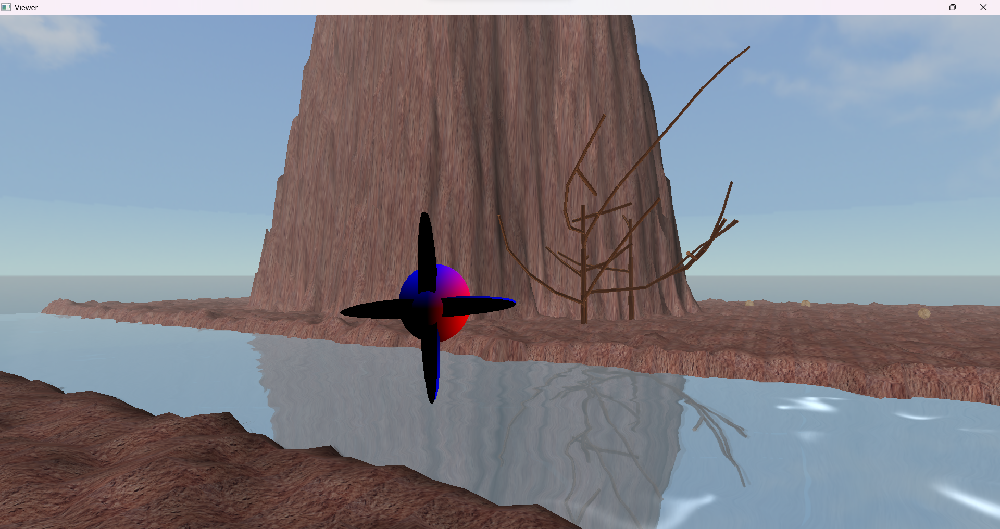

# Project-OpenGL

[**Project-OpenGL**](https://github.com/PyroWilDx/Project-OpenGL/) is a vizualization application that allows users to explore a 3d environment.

- Procedural Terrain
- Procedural Trees
- Particle System
- SkyBox
- Animated Refractive & Reflective Water
- Player Controls



This project was made in a **Team of 2** as part of the **3d Graphics** course at [Grenoble INP &ndash; Ensimag](https://ensimag.grenoble-inp.fr/).

## Development Set-Up

<div align="center">

| [](https://www.python.org/) | [](https://www.opengl.org/) | [](https://www.jetbrains.com/pycharm/) | [](https://www.microsoft.com/windows/) |
|---|---|---|---|

</div>

### How To Use

- Install all required Python packages w/ [```Requirements.txt```](./Requirements.txt).

```
pip install -r Requirements.txt
```

- Run [```Viewer.py```](./Viewer.py) w/ Python.

---

<div align="center">
  Copyright &#169; 2024 PyroWilDx. All Rights Reserved.
</div>
